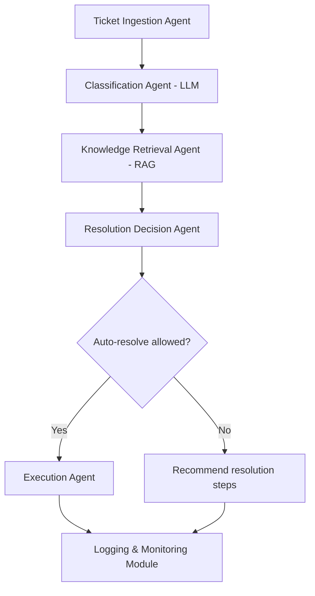

# IT / Ticket Auto-Resolution Agent

An Agentic AI system that analyzes incoming IT service tickets, identifies the root cause, and recommends or automatically executes resolution steps using historical knowledge and logs.

This capstone project is designed for an individual developer with basic knowledge of Python, Generative AI, and Agentic AI. It demonstrates how autonomous agents can support IT operations by reducing manual effort and improving ticket resolution time.

> **New here? Read the full build & demo walkthrough in [`stepbystepprocess.md`](stepbystepprocess.md)** — it has step-by-step instructions, diagrams, a copy-paste demo cheat-sheet, and a plain-English glossary.

---

## Quick Start

```powershell
# 1. From the project folder, create and activate a virtual environment
python -m venv .venv
.\.venv\Scripts\Activate.ps1        # if blocked: Set-ExecutionPolicy -Scope Process -ExecutionPolicy RemoteSigned

# 2. Install dependencies
pip install -r requirements.txt

# 3. Run the full pipeline over all "New" tickets
python main.py --reset-run
```

Expected output: a summary table showing **4 auto-resolved** (Password Reset ×2, VPN, Disk Space) and **4 escalated** (Access Request, Software, Email, Printer).

### Running the agent

| Command | What it does |
| --- | --- |
| `python main.py` | Process all tickets currently in status `New` |
| `python main.py --reset-run` | Reset all tickets to `New`, then process (best for repeatable demos) |
| `python main.py --reset` | Reset tickets to `New` only (no processing) |

### Testing

```powershell
python -m unittest discover -s tests -v
```

Runs the full suite (14 tests) covering classification, RAG retrieval, decision logic, the auto-resolve/escalate **guardrails**, and an end-to-end run. Uses Python's built-in `unittest` — no extra install needed.

### Online vs Offline modes (no code changes)

The agent checks the network first and falls back automatically, so it runs anywhere:

| | Online (personal laptop, endpoint reachable) | Offline (locked-down network) |
| --- | --- | --- |
| Classification & Decision | **llama3.2** via Ollama | Keyword classifier + runbook extraction |
| RAG embeddings | **Ollama embeddings** | scikit-learn TF-IDF (no downloads) |

Confirm which mode you're in before a demo:

```powershell
python -c "from src.llm import is_available; from src.agents.retrieval import RetrievalAgent; print('LLM online:', is_available()); print('RAG backend:', RetrievalAgent().backend)"
```

### Project structure

```
IT-Ticket-Auto-Resolution-Agent/
├── main.py                     # entry point (CLI + summary table)
├── src/
│   ├── agents/                 # ingestion, classification, retrieval, decision, execution
│   ├── orchestrator.py         # sequential pipeline + audit logging
│   ├── servicenow_client.py    # REST client stub + mock JSON store
│   ├── llm.py                  # Ollama access + availability check
│   ├── config.py               # YAML + .env loader
│   └── logging_setup.py        # logger + JSON audit trail
├── data/tickets.json           # 8 synthetic tickets
├── knowledge_base/*.md         # 7 runbooks (the RAG source)
├── prompts/*.txt               # LLM prompt templates
├── config/*.yaml               # ServiceNow rules, categories, logging
├── tests/                      # 14 unittest tests
├── tools/generate_ppt.py       # builds the demo slide deck
├── stepbystepprocess.md        # full build & demo guide
└── requirements.txt
```

---

## Table of Contents

- [1. Project Overview](#1-project-overview)
- [2. Objectives and Learning Outcomes](#2-objectives-and-learning-outcomes)
- [3. Functional Requirements](#3-functional-requirements)
- [4. Non-Functional Requirements](#4-non-functional-requirements)
- [5. High-Level Architecture](#5-high-level-architecture)
- [6. Input Files and Configuration](#6-input-files-and-configuration)
- [7. High-Level Activity Plan (20 Hours)](#7-high-level-activity-plan-20-hours)
- [8. Deliverables](#8-deliverables)
- [9. Success Criteria](#9-success-criteria)

---

## 1. Project Overview

**Project Name:** IT / Ticket Auto-Resolution Agent

**Project Description:**

An Agentic AI system that analyzes incoming IT service tickets, identifies the root cause, and recommends or automatically executes resolution steps using historical knowledge and logs.

This capstone project is designed for an individual developer with basic knowledge of Python, Generative AI, and Agentic AI. The project demonstrates how autonomous agents can support IT operations by reducing manual effort and improving ticket resolution time.

---

## 2. Objectives and Learning Outcomes

### Objectives

- Design an Agentic AI workflow for IT ticket resolution
- Use LLMs to analyze and classify IT incidents
- Apply Retrieval-Augmented Generation (RAG) for solution recommendation
- Integrate with ServiceNow API for ticket operations

### Learning Outcomes

- Understanding of autonomous IT support agents
- Practical experience with RAG-based decision systems
- Exposure to enterprise-style AI integrations

---

## 3. Functional Requirements

- Ingest IT tickets from ServiceNow API or mock dataset
- Analyze ticket description, category, and priority
- Retrieve similar historical incidents and resolutions using RAG
- Recommend resolution steps with confidence scoring
- Optionally auto-resolve predefined ticket types
- Update ticket status and comments in ServiceNow
- Log all decisions and actions for audit

---

## 4. Non-Functional Requirements

- Python 3.x based implementation
- Explainable decision-making
- Modular, extensible agent-based design
- Secure handling of credentials
- Suitable for single-user prototype execution

---

## 5. High-Level Architecture

The IT / Ticket Auto-Resolution Agent follows an Agentic AI architecture where each step in the ticket resolution lifecycle is handled by a specialized component.

### Core Components

| Component | Responsibility |
| --- | --- |
| **Ticket Ingestion Agent** | Fetches new tickets from ServiceNow |
| **Classification Agent (LLM)** | Determines issue type and severity |
| **Knowledge Retrieval Agent (RAG)** | Retrieves relevant resolution data |
| **Resolution Decision Agent** | Chooses recommendation or auto-fix |
| **Execution Agent** | Performs automated actions where allowed |
| **Logging & Monitoring Module** | Records actions and outcomes |

### Workflow



---

## 6. Input Files and Configuration

| File / Directory | Description |
| --- | --- |
| `tickets.json` | Mock IT ticket dataset with description, category, and priority |
| `knowledge_base/` | Historical incident resolutions and runbooks |
| `servicenow_config.yaml` | API endpoints, credentials, and ticket rules |
| `prompts/` | LLM prompt templates for classification and resolution |
| `logging_config.yaml` | Logging levels and output destinations |

---

## 7. High-Level Activity Plan (20 Hours)

### Phase 1: Planning and Dataset Preparation (3 Hours)

- Define ticket categories and automation scope
- Prepare mock tickets and knowledge base

### Phase 2: Core Agent Development (7 Hours)

- Implement ticket ingestion and classification
- Build RAG retrieval pipeline

### Phase 3: Resolution and Execution Logic (5 Hours)

- Implement recommendation logic
- Add safe auto-resolution flows

### Phase 4: Testing and Refinement (3 Hours)

- Test across common IT scenarios
- Tune prompts and retrieval accuracy

### Phase 5: Documentation and Final Review (2 Hours)

- Prepare README and architecture summary

---

## 8. Deliverables

- Python source code
- Sample tickets and knowledge base
- Logged resolution outputs
- Documentation and usage guide

---

## 9. Success Criteria

- Accurate ticket analysis and resolution recommendations
- Clear explainability and logging
- Successful ServiceNow interaction (or mock)
- Completion within 20 hours
- Extensible design for future automation
