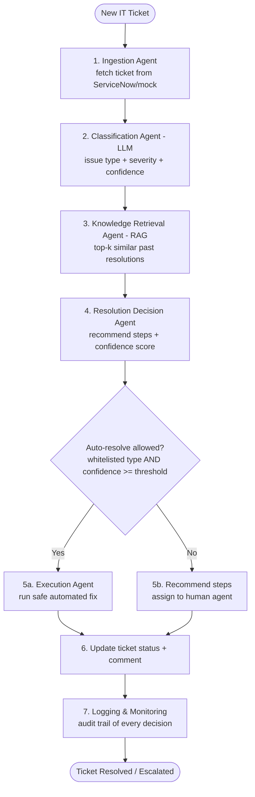
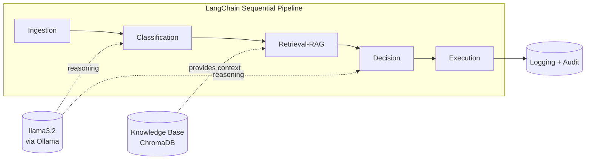
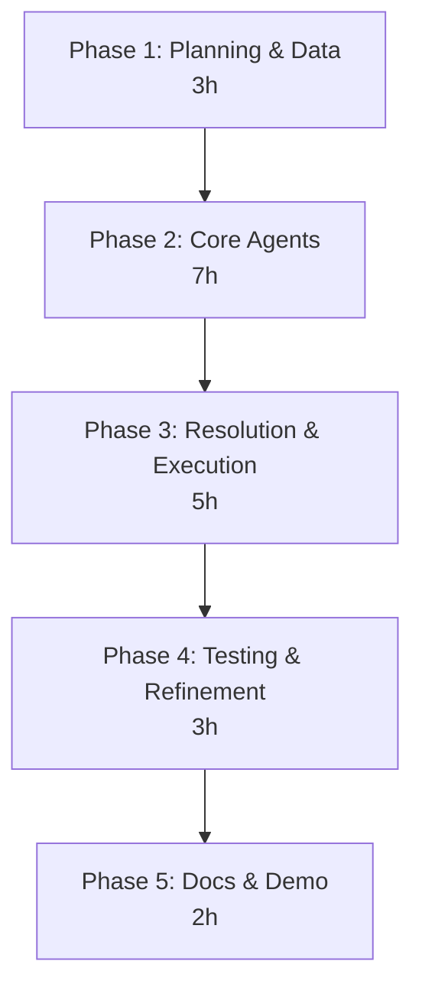
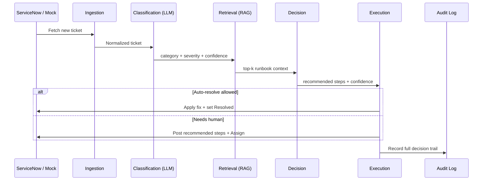
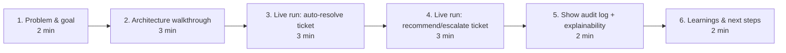
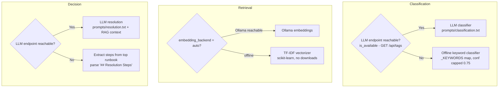

# Step-by-Step Process — IT / Ticket Auto-Resolution Agent (CP06)

> **Purpose:** A workflow-formatted build & demo guide for the capstone project.
> Use this as your presentation script and progress tracker.

**Project:** IT / Ticket Auto-Resolution Agent
**CoP Tier:** Agentic AI Advance
**Required Tools:** ServiceNow API, LLM, RAG, Logging System

### Confirmed Design Decisions
| # | Decision | Choice |
|---|----------|--------|
| 1 | Orchestration framework | **LangChain sequential agents** (simple pipeline — first agentic project) |
| 2 | ServiceNow integration | **Optional real REST client stub** + mock fallback (no live creds needed for demo) |

### Provided Infrastructure
| Item | Value |
|------|-------|
| LLM endpoint | `http://34.207.216.209:11434` (Ollama, free & unlimited) |
| Model | `llama3.2` |
| Access library | `langchain-ollama` → `ChatOllama` |
| Data | Synthetic tickets + local knowledge base |

---

## 1. End-to-End Solution Workflow



---

## 2. Agent Responsibilities (Pipeline Stages)



| Stage | Agent | Input | Output |
|-------|-------|-------|--------|
| 1 | **Ingestion Agent** | ServiceNow / `tickets.json` | Normalized ticket object |
| 2 | **Classification Agent (LLM)** | Ticket description | `category`, `severity`, `confidence` |
| 3 | **Knowledge Retrieval Agent (RAG)** | Classified ticket | Top-k runbook snippets |
| 4 | **Resolution Decision Agent** | Classification + retrieved context | Recommended steps + `confidence` |
| 5 | **Execution Agent** | Decision + auto-resolve policy | Action performed OR steps recommended |
| 6 | **Logging & Monitoring** | All stage outputs | JSON audit log entry |

---

## 3. Build Phases (20-Hour Plan)



### Phase 1 — Planning & Data Preparation (3h)
1. Scaffold repo folders: `src/agents/`, `data/`, `knowledge_base/`, `prompts/`, `config/`, `logs/`, `tests/`.
2. Define ticket **categories** and **auto-resolve whitelist**:
   - Password Reset ✅ auto
   - VPN Connectivity ✅ auto
   - Software Installation ⚠️ recommend
   - Disk Space Cleanup ✅ auto
   - Access / Permission Request ❌ human approval
3. Generate synthetic `tickets.json` (id, description, category, priority, status).
4. Author `knowledge_base/` runbooks (past incidents + resolution steps) for RAG.

### Phase 2 — Core Agent Development (7h)
5. **Ingestion Agent** — ServiceNow REST client stub + mock JSON reader.
6. **Classification Agent** — LLM prompt → issue type, severity, confidence.
7. **RAG pipeline** — embed KB into ChromaDB (`sentence-transformers`), retrieve top-k.

### Phase 3 — Resolution & Execution Logic (5h)
8. **Resolution Decision Agent** — merge classification + retrieved context → steps + score.
9. **Execution Agent** — safe auto-resolve for whitelisted types; else recommend.
10. **Ticket update** — write status/comment back to ServiceNow/mock store.

### Phase 4 — Testing & Refinement (3h)
11. Run across scenarios (each category), tune prompts + retrieval `k`, add guardrails.

### Phase 5 — Documentation & Demo (2h)
12. Finalize README, this workflow doc, sample logs, and the demo PPT.

---

## 4. Data Flow (Single Ticket)



---

## 5. Repository Layout

```
IT-Ticket-Auto-Resolution-Agent/
├── src/
│   ├── agents/
│   │   ├── ingestion.py        # ServiceNow stub + mock reader
│   │   ├── classification.py   # LLM classifier
│   │   ├── retrieval.py        # RAG over ChromaDB
│   │   ├── decision.py         # recommendation + confidence
│   │   └── execution.py        # safe auto-resolve / recommend
│   ├── orchestrator.py         # sequential LangChain pipeline
│   ├── servicenow_client.py    # REST client stub (+ mock)
│   ├── llm.py                  # ChatOllama config
│   └── logging_setup.py        # audit logging
├── data/tickets.json           # synthetic tickets
├── knowledge_base/*.md         # runbooks for RAG
├── prompts/*.txt               # LLM prompt templates
├── config/
│   ├── servicenow_config.yaml  # endpoints, rules, whitelist
│   └── logging_config.yaml
├── logs/                       # audit output
├── tests/                      # scenario tests
├── requirements.txt
└── main.py                     # entry point
```

---

## 6. Demo Run Order (15-Minute Presentation)



| # | Segment | Time | What to show |
|---|---------|------|--------------|
| 1 | Problem & objective | 2 min | Manual IT triage pain → agentic automation |
| 2 | Architecture | 3 min | The 6-agent pipeline diagram (Section 1) |
| 3 | Auto-resolve demo | 3 min | Run a Password Reset ticket → auto-resolved |
| 4 | Escalation demo | 3 min | Run an Access Request → recommended + assigned |
| 5 | Explainability | 2 min | Open the JSON audit log, show confidence & reasoning |
| 6 | Learnings / roadmap | 2 min | RAG accuracy, guardrails, real ServiceNow next |

---

## 7. Progress Tracker

| Phase | Status |
|-------|--------|
| Phase 1 — Planning & Data | ✅ Done — scaffold, `tickets.json` (8), 7 runbooks, config, prompts |
| Phase 2 — Core Agents | ✅ Done — ingestion, LLM classification, RAG (Ollama/offline TF-IDF). LLM endpoint pending network access |
| Phase 3 — Resolution & Execution | ✅ Done — Decision Agent (LLM/offline runbook), Execution Agent (auto-resolve/escalate policy), orchestrator + `main.py`. E2E offline: 4 auto-resolved, 4 escalated |
| Phase 4 — Testing & Refinement | ✅ Done — 14 `unittest` tests (classification, retrieval, decision, execution guardrails, end-to-end). All passing offline. See Section 13 |
| Phase 5 — Docs & Demo | ✅ Done — finalized `README.md` (quick start/run/test/modes), refreshed 8-slide demo `.pptx`, generated sample `logs/audit.jsonl` |

---

## 8. Resilience — Network-First with Automatic Offline Fallback

> **Why this matters:** the LLM endpoint (`http://34.207.216.209:11434`) and Hugging Face
> model downloads are **not reachable from the corporate machine** used to build this.
> Every AI step therefore checks the network first, and if it fails, silently switches to an
> offline path so the whole pipeline still runs and the demo never breaks. On a personal
> laptop where the endpoint is reachable, the **same code** automatically uses the real LLM —
> no changes needed.



| AI step | Online path | Offline fallback | Where |
|---------|-------------|------------------|-------|
| Availability check | `GET {base}/api/tags` (cached) | returns `False` → triggers fallbacks | `src/llm.py` → `is_available()` |
| Classification | `ChatOllama` + `prompts/classification.txt` | `_KEYWORDS` keyword match, `method="offline_keywords"` | `src/agents/classification.py` |
| Retrieval (RAG) | Ollama embeddings into ChromaDB | **TF-IDF** (scikit-learn) into ChromaDB, `method="tfidf"` | `src/agents/retrieval.py` |
| Decision | `ChatOllama` + `prompts/resolution.txt` | parse steps from top runbook, `method="offline_runbook"` | `src/agents/decision.py` |

**Confidence handling offline:** the Decision Agent sets confidence to **0.85** when the
best-matching runbook file corresponds to the classified category (a strong grounded match),
`0.7` on a weak match, `0.3` if no steps were found. This lets whitelisted categories cross
the `0.80` auto-resolve threshold even with **no network**.

**SSL note:** corporate SSL interception is handled by `truststore.inject_into_ssl()` in
`src/__init__.py`, which uses the Windows certificate store so `pip` and HTTPS calls work.

---

## 9. How to Run (Exact Commands)

> Windows PowerShell. Python 3.14 at
> `C:/Users/anvesh.devulapally/AppData/Local/Programs/Python/Python314/python.exe`.

```powershell
# 1. Go to the project
cd "c:\Users\anvesh.devulapally\Capstone project\IT-Ticket-Auto-Resolution-Agent"

# 2. Install dependencies (uses corporate proxy automatically)
& "C:/Users/anvesh.devulapally/AppData/Local/Programs/Python/Python314/python.exe" -m pip install -r requirements.txt

# 3. Run the full pipeline over all NEW tickets
& "C:/Users/anvesh.devulapally/AppData/Local/Programs/Python/Python314/python.exe" main.py

# 4. Reset tickets back to 'New' AND run again (best for a repeatable demo)
& "C:/Users/anvesh.devulapally/AppData/Local/Programs/Python/Python314/python.exe" main.py --reset-run

# 5. Only reset tickets to 'New' (no processing)
& "C:/Users/anvesh.devulapally/AppData/Local/Programs/Python/Python314/python.exe" main.py --reset

# 6. Regenerate the demo PowerPoint
& "C:/Users/anvesh.devulapally/AppData/Local/Programs/Python/Python314/python.exe" tools/generate_ppt.py
```

**What you'll see on startup** — a line telling you which mode is active, e.g.
`Runtime mode -> LLM: offline (keyword/runbook fallback) | Embeddings: tfidf`
(on your personal laptop this becomes `LLM: online | Embeddings: ollama`).

**Where results go:**
- Ticket status/comments → `data/tickets.json` (mock ServiceNow store)
- Structured decision trail → `logs/audit.jsonl` (one JSON line per stage)
- Human-readable run log → `logs/run.log`

**Latest verified offline result:** 8 tickets → **4 auto-resolved** (Password Reset ×2, VPN
Connectivity, Disk Space Cleanup) and **4 escalated** (Access Request = always-human;
Software Install, Email, Printer = not whitelisted).

---

## 10. File-by-File Build Journal (What We Did & Where)

> Read top-to-bottom to understand the whole codebase. Each row is something we actually
> built and the exact file it lives in.

### Configuration & environment
| File | What it does |
|------|--------------|
| `requirements.txt` | Pins langchain, langchain-ollama, chromadb, scikit-learn, pyyaml, python-dotenv, requests, truststore, python-pptx |
| `.env` (from `.env.example`) | `OLLAMA_BASE_URL`, `OLLAMA_MODEL=llama3.2`, blank `SERVICENOW_*` creds |
| `config/servicenow_config.yaml` | Mock mode flag, the 7 categories, auto-resolve `confidence_threshold: 0.80`, `whitelist`, `always_human`, retrieval `top_k` and `embedding_backend: auto` |
| `config/logging_config.yaml` | Console INFO, audit JSONL, run.log DEBUG |
| `src/__init__.py` | Injects `truststore` for corporate SSL; sets version |
| `src/config.py` | `load_config()` (cached YAML merge), `get_env()`, `llm_settings()`, `path()` helper |
| `src/logging_setup.py` | `setup_logging()` logger + `AuditTrail.record()` writing `logs/audit.jsonl` |

### Data & knowledge
| File | What it does |
|------|--------------|
| `data/tickets.json` | 8 synthetic tickets (INC0012001–008) covering every category |
| `knowledge_base/*.md` | 7 runbooks (Symptoms, Root Causes, **Resolution Steps**, Automated Action, Verification) — the RAG source |
| `prompts/classification.txt` | LLM prompt → JSON `{category, severity, confidence, reasoning}` |
| `prompts/resolution.txt` | LLM prompt → JSON `{resolution_steps, confidence, summary}` |

### The agents (the heart of the project)
| File | What it does |
|------|--------------|
| `src/llm.py` | `is_available()` network check, `get_llm()` (ChatOllama), `invoke_json()`, `LLMUnavailableError` |
| `src/servicenow_client.py` | `get_new_tickets()` / `update_ticket()` — mock JSON store **or** real REST (Table API) if creds present |
| `src/agents/ingestion.py` | Fetches + **normalizes** tickets into a common shape |
| `src/agents/classification.py` | LLM classifier **+ offline keyword fallback** (`_KEYWORDS`) |
| `src/agents/retrieval.py` | RAG over ChromaDB with **Ollama or TF-IDF** embeddings, `retrieve()`, `format_context()` |
| `src/agents/decision.py` | LLM resolution **+ offline runbook-extraction fallback**, confidence heuristic |
| `src/agents/execution.py` | Auto-resolve vs escalate **policy**, simulated fixes, writes back to ServiceNow |
| `src/orchestrator.py` | Sequential pipeline ingest→classify→retrieve→decide→execute + audit at every stage |
| `main.py` | CLI entry point: `--reset`, `--reset-run`, prints the summary table |

### Tooling & deliverables
| File | What it does |
|------|--------------|
| `tools/generate_ppt.py` | Builds the 8-slide 15-minute demo `.pptx` |
| `tools/smoke_test_phase2.py` | Standalone check of ingestion + RAG + classification (passes offline) |
| `stepbystepprocess.md` | **This file** — the build & demo guide you are reading |

### The auto-resolve policy (implemented in `execution.py`)
A ticket is **auto-resolved** only when **all** are true:
1. Category is on the `whitelist` (Password Reset, VPN Connectivity, Disk Space Cleanup), **and**
2. Category is **not** in `always_human` (Access Request), **and**
3. Decision confidence ≥ `confidence_threshold` (0.80).

Otherwise it is **escalated**: recommended steps are posted and it's assigned to the
service-desk queue. Simulated automated actions: `reset_password`, `reset_vpn_session`,
`cleanup_disk`.

---

## 11. Environment Notes & Troubleshooting

| Symptom | Cause | Handling in this project |
|---------|-------|--------------------------|
| Ollama calls fail / TCP refused | Endpoint not reachable from corporate network | `is_available()` detects it → offline fallbacks kick in automatically |
| `huggingface.co` 403 | Corporate proxy blocks model downloads | We use **TF-IDF** (scikit-learn) — no downloads needed |
| `CERTIFICATE_VERIFY_FAILED` | Corporate SSL interception | `truststore.inject_into_ssl()` in `src/__init__.py` |
| `pip` can't reach PyPI | Must use internal proxy | Use `nexus-dev.onefiserv.net` proxy (already configured on the machine) |
| Nothing auto-resolves offline | Decision confidence below 0.80 | Fixed via runbook-match confidence heuristic (0.85 on strong match) |
| Demo needs a clean re-run | Tickets already Resolved | `python main.py --reset-run` |

> **On the personal laptop:** once the Ollama endpoint is reachable, no code changes are
> needed. The startup log will show `LLM: online | Embeddings: ollama` and classification +
> resolution will be produced by `llama3.2` instead of the offline fallbacks.

---

## 12. Glossary (Plain-English, for your first agentic project)

> Read this once and the rest of the doc (and the interview questions) will make sense.

| Term | What it means | How we use it here |
|------|---------------|--------------------|
| **Agent** | A software component that takes an input, makes a decision (often using an LLM), and produces an action or output — not just a fixed script. | Each pipeline stage (Ingestion, Classification, Retrieval, Decision, Execution) is an agent. |
| **Agentic AI** | An application built from one or more agents that reason and act toward a goal, chaining steps together. | The whole ticket auto-resolution pipeline. |
| **LLM (Large Language Model)** | An AI trained on huge amounts of text that can understand and generate language, classify, summarize, and reason. | `llama3.2` reads a ticket and returns its category, severity, and resolution steps. |
| **Ollama** | A tool/server that hosts open-source LLMs and exposes them over a simple HTTP API. | Our LLM is served at `http://34.207.216.209:11434`. |
| **ChatOllama** | The LangChain class used to send prompts to an Ollama model and get responses. | Created in `src/llm.py`. |
| **LangChain** | A Python framework for building LLM apps — connecting prompts, models, and tools into pipelines. | We use its **sequential** style: agents run one after another. |
| **Prompt** | The text instruction we send to the LLM, including the ticket details and the exact output format we want. | `prompts/classification.txt` and `prompts/resolution.txt`. |
| **Prompt template** | A prompt with `{placeholders}` we fill in per ticket. | `.format(short_description=..., description=...)`. |
| **RAG (Retrieval-Augmented Generation)** | Instead of relying only on the LLM's memory, we first **retrieve** relevant reference docs and feed them to the model so answers are grounded in our own knowledge. | We retrieve the most relevant runbook, then base the resolution on it. |
| **Knowledge base** | The collection of reference documents RAG searches. | The 7 runbooks in `knowledge_base/*.md`. |
| **Runbook** | A step-by-step document describing how to resolve a specific type of issue. | e.g. `password_reset.md` with a "Resolution Steps" section. |
| **Embedding** | Turning text into a list of numbers (a vector) so a computer can measure how *similar* two pieces of text are. | We embed each runbook and each ticket to find the closest match. |
| **Vector / vector store** | The numeric form of text, and the database that stores and searches them by similarity. | We store runbook vectors in **ChromaDB**. |
| **ChromaDB** | A lightweight vector database used for similarity search in RAG. | Holds our runbook embeddings; queried in `retrieval.py`. |
| **Embedding backend** | The method that produces embeddings. We support two. | `ollama` (online) or `tfidf` (offline); `auto` picks automatically. |
| **TF-IDF** | *Term Frequency–Inverse Document Frequency* — a classic, math-only way to turn text into vectors by weighting important words. **No internet or model download needed.** | Our offline fallback (via scikit-learn) so RAG works with no network. |
| **top-k** | How many of the most similar documents RAG returns. | `top_k: 3` — we look at the 3 closest runbooks. |
| **Confidence score** | A 0–1 number saying how sure the agent is about its answer. | Used to decide whether to auto-resolve. |
| **Threshold** | The minimum confidence required to take an automated action. | `confidence_threshold: 0.80`. |
| **Whitelist** | The categories we *allow* to be auto-resolved. | Password Reset, VPN Connectivity, Disk Space Cleanup. |
| **Always-human** | Categories that must go to a person regardless of confidence. | Access Request (security-sensitive). |
| **Auto-resolve vs Escalate** | Either the agent fixes it automatically, or it hands off to a human with recommended steps. | Decided in `execution.py`. |
| **Orchestrator** | The controller that runs the agents in order and passes data between them. | `src/orchestrator.py`. |
| **Audit trail / audit log** | A record of every decision made, saved for transparency and explainability. | JSON lines in `logs/audit.jsonl`. |
| **Mock mode** | Simulating an external system (ServiceNow) with a local file instead of real API calls. | Reads/writes `data/tickets.json`. |
| **ServiceNow** | A popular enterprise IT service management platform where tickets live. | We integrate via a REST client stub, with a mock fallback for the demo. |
| **REST API / Table API** | The HTTP interface used to read and write records (like tickets) in a system such as ServiceNow. | Our real (optional) client would call ServiceNow's Table API. |
| **Network-first / offline fallback** | Try the online (LLM/Ollama) path first; if unreachable, automatically switch to an offline method. | Core resilience pattern — see Section 8. |
| **truststore** | A library that lets Python use the operating system's certificate store, fixing SSL errors behind a corporate proxy. | Enabled in `src/__init__.py`. |
| **Synthetic data** | Fake but realistic sample data created for testing/demo. | Our 8 sample tickets. |
| **Virtual environment (venv)** | An isolated per-project Python with its own installed packages, so projects don't clash. | `python -m venv .venv` then activate it on your laptop. |
| **`pip` / `requirements.txt`** | `pip` installs Python packages; `requirements.txt` lists exactly which ones (and versions) the project needs. | `pip install -r requirements.txt`. |
| **Preflight check** | A quick command run before the demo to confirm you're in the expected (online) mode. | Step 0.5 prints `LLM online` and `RAG backend`. |
| **python-pptx** | A Python library that builds PowerPoint (`.pptx`) files programmatically. | `tools/generate_ppt.py` generates the demo deck. |
| **Unit test** | A small automated check that verifies one piece of code behaves as expected. | e.g. "does the classifier label a VPN ticket as VPN Connectivity?" |
| **Test suite** | A whole collection of tests run together. | Our `tests/` folder (14 tests). |
| **`unittest`** | Python's built-in testing framework — needs no extra install. | We use it so tests run anywhere, even offline. |
| **Assertion** | A statement in a test that must be true, or the test fails. | `self.assertEqual(result["category"], "Password Reset")`. |
| **subTest** | A `unittest` feature to loop many cases in one test and see exactly which case failed. | Used to test all 7 categories in one method. |
| **Mock / patch** | Temporarily replacing a function so a test is predictable. | We `patch` `is_available` to `False` to force the offline path. |
| **Fake / stub** | A lightweight stand-in for a real component used only in tests. | `FakeServiceNowClient` records updates in memory instead of writing files. |
| **Guardrail** | A safety rule that prevents unwanted automated actions. | "Never auto-resolve an Access Request" — proven by a test. |
| **End-to-end (E2E) test** | A test that runs the whole pipeline from start to finish. | `test_end_to_end.py` runs all 8 tickets through every agent. |
| **Regression** | A bug where something that used to work breaks after a change. | The test suite catches regressions before the demo. |

---

## 13. Phase 4 — Test Suite (What We Test & How to Run)

> **Goal of this phase:** prove the pipeline behaves correctly for every category
> and that the safety guardrails hold — so nothing embarrassing happens live in the
> 15-minute demo. Tests use Python's built-in `unittest` (no extra install needed)
> and run fully offline.

### How to run the tests
```powershell
cd "c:\Users\anvesh.devulapally\Capstone project\IT-Ticket-Auto-Resolution-Agent"
& "C:/Users/anvesh.devulapally/AppData/Local/Programs/Python/Python314/python.exe" -m unittest discover -s tests -v
```
Expected: `Ran 14 tests ... OK`.

### What each test file checks
| File | What it proves |
|------|----------------|
| `tests/helpers.py` | Shared setup: puts project root on the path; provides `FakeServiceNowClient` (in-memory, so tests never write `data/tickets.json`) |
| `tests/test_classification.py` | The offline keyword classifier labels a representative ticket for **all 7 categories** correctly; unknown text → `Unknown` with low confidence |
| `tests/test_retrieval.py` | The RAG index builds (≥7 runbooks) and the **correct runbook ranks first** for Password/VPN/Disk/Printer tickets; context string includes sources |
| `tests/test_decision.py` | Offline step-extraction from a runbook works; confidence heuristic is **0.85** (strong match), **0.7** (weak), **0.3** (no steps) |
| `tests/test_execution_policy.py` | **Guardrails:** whitelisted + high confidence → auto-resolve; low confidence → escalate; **Access Request never auto-resolves even at 0.99**; non-whitelisted escalates; a ticket update is always written |
| `tests/test_end_to_end.py` | The whole pipeline runs over all 8 tickets, every ticket gets a valid outcome + status; the ticket store is snapshotted and **restored** afterward (no side effects) |

### Test design choices (and why)
1. **`unittest`, not pytest** — the corporate proxy could not install pytest reliably; `unittest` ships with Python, so the suite always runs.
2. **Force offline with `patch(... is_available, False)`** — makes classification/decision tests deterministic regardless of network, so they pass identically on this machine and your personal laptop.
3. **`FakeServiceNowClient`** — the Execution Agent accepts an injected client, so guardrail tests verify behavior without touching real data.
4. **E2E snapshot & restore** — the end-to-end test resets tickets, runs, asserts, then writes the original file back so nothing is left dirty.
5. **Assert on structure, not exact tickets, in E2E** — so the same test passes online (LLM) and offline (fallback).

### Refinements made during Phase 4
- Confirmed the offline confidence heuristic lets whitelisted categories cross the 0.80 threshold (Password Reset/VPN/Disk auto-resolve offline; the earlier 0.70 value did not).
- Verified the ordering of policy checks: `always_human` is evaluated **before** the whitelist, so a sensitive category can never slip through on high confidence.

---

## 14. Demo Cheat-Sheet (Copy-Paste, In Order)

> **Use this during the live 15-minute demo.** Copy each block into PowerShell in
> order. Every command has been verified to work on this machine. The `$PY`
> variable is set once so the rest of the commands are short.

### Step 0 — Open a terminal and set up (run once at the start)
```powershell
# Set a shortcut to the Python interpreter (proven to work)
$PY = "C:/Users/anvesh.devulapally/AppData/Local/Programs/Python/Python314/python.exe"

# Go to the project folder
cd "c:\Users\anvesh.devulapally\Capstone project\IT-Ticket-Auto-Resolution-Agent"
```

### Step 0 (Alternative) — Use a virtual environment (recommended on your personal laptop)
```powershell
# From the project folder, create + activate a venv and install everything
python -m venv .venv
.\.venv\Scripts\Activate.ps1        # if blocked: Set-ExecutionPolicy -Scope Process -ExecutionPolicy RemoteSigned
pip install -r requirements.txt

# When a venv is active, you can use `python` directly instead of $PY:
$PY = "python"
```

### Step 0.5 — Verify ONLINE mode (run on your personal laptop where the endpoint is reachable)
```powershell
& $PY -c "from src.llm import is_available; from src.agents.retrieval import RetrievalAgent; print('LLM online:', is_available()); print('RAG backend:', RetrievalAgent().backend)"
```
*On your laptop (network OK):* `LLM online: True` and `RAG backend: ollama` — meaning the **real LLM + Ollama embeddings** are being used.
*On the locked-down machine:* `LLM online: False` and `RAG backend: tfidf` — offline fallback. **No code change needed either way.**

### Step 1 — Run the tests (show everything works: 14 tests pass)
```powershell
& $PY -m unittest discover -s tests -v
```
*Expected last line:* `Ran 14 tests in ~9s ... OK`

### Step 2 — Run the full pipeline (the main demo)
```powershell
& $PY main.py --reset-run
```
*Expected:* a summary table — **4 auto-resolved** (Password Reset ×2, VPN, Disk Space), **4 escalated** (Access Request, Software, Email, Printer).

### Step 2.5 — Create a NEW ticket LIVE and let the LLM resolve it (crowd favourite)
> This is the "wow" moment: raise a brand-new ticket in front of the audience and
> watch the **online LLM** classify + resolve it end-to-end. On your personal
> laptop (where the Ollama endpoint is reachable) this runs through the real LLM.

**Option A — one command (add + process immediately):**
```powershell
& $PY main.py --add-ticket --short "Forgot my password and locked out" --desc "User returned from leave and cannot sign in to Windows; needs a password reset to access email." --priority High --run
```
*What happens:* a new ticket (e.g. `INC0012009`) is appended with status `New`, then
the pipeline runs. On the summary table it should be classified **Password Reset**
and **auto-resolved** (Password Reset is whitelisted).

**Option B — interactive (type the details when prompted):**
```powershell
& $PY main.py --add-ticket
# You'll be asked for: Short description, Description, Priority. Then:
& $PY main.py
```

**Show the safety guardrail — raise a ticket that MUST go to a human:**
```powershell
& $PY main.py --add-ticket --short "Need admin access to finance shared folder" --desc "Requesting write/admin permissions to the finance department shared drive." --priority Medium --run
```
*Talking point:* even with high confidence, **Access Request** is on the
`always_human` list, so the agent **escalates** instead of auto-resolving —
demonstrating the responsible-AI guardrail.

> **Confirm you're using the online LLM first:** run **Step 0.5** and make sure it
> prints `LLM online: True` and `RAG backend: ollama` before this demo. If it says
> `False`/`tfidf`, the network to the Ollama endpoint isn't reachable — the demo
> still works, but via the offline fallback.

### Step 3 — Show the audit trail (explainability)
```powershell
# Pretty-print the last few audit entries (per-stage decision trail)
Get-Content logs\audit.jsonl -Tail 5
```
*Talking point:* every decision (classification, retrieval, decision, execution) is logged with its confidence and method for full transparency.

### Step 4 — Show one ticket's final state (auto-resolved example)
```powershell
& $PY -c "import json;d=json.load(open('data/tickets.json'));t=[x for x in d if x['id']=='INC0012001'][0];print('Status:',t['status']);print(t.get('resolution_comment',''))"
```

### Step 5 — (Optional) Regenerate the demo slides
```powershell
& $PY tools/generate_ppt.py
```

### Step 6 — Reset for a clean re-run (if you want to demo again)
```powershell
& $PY main.py --reset
```

> **Backup plan:** if anything misbehaves live, just re-run **Step 6** then **Step 2** —
> `--reset-run` always gives the same clean, repeatable result, and it works with
> **no network** (offline TF-IDF + keyword/runbook fallback).
